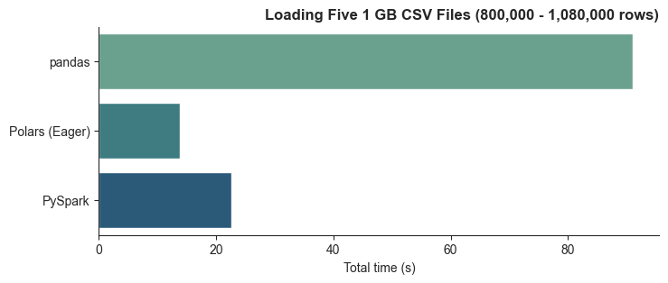

# Speed Test: pandas vs. Polars vs. PySpark

I conducted a performance benchmark to compare the execution times of three popular Python libraries—Pandas, Polars, and PySpark—for reading data from files. Understanding execution times is crucial for data analysts, particularly when working with large datasets, as lengthy loading times can significantly impact productivity.

## Motivation
Polars has entered the field as a competitor to pandas, boasting more efficient handling of larger files. 
Pandas remains a robust tool due to its extensive functionality and integration with various libraries. 
For extremely large datasets, PySpark is renowned for its scalability and performance.

## Results

Following this analysis, I plan to integrate these libraries into my workflow according to the needs of different data processing scenarios.
